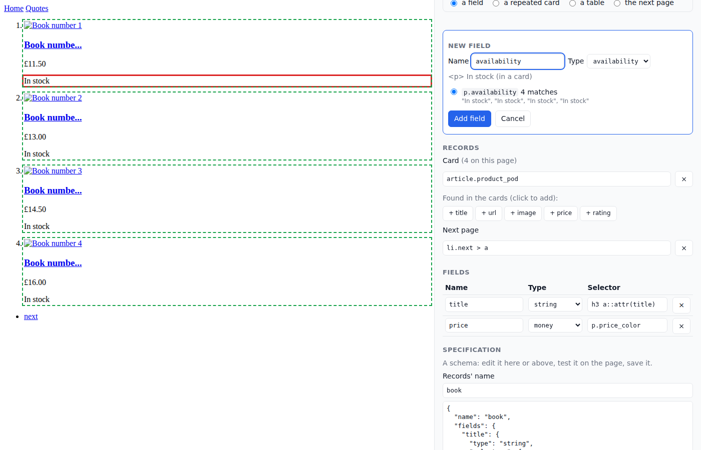

# The visual builder

`wintergrab build` shows a page and lets you click its parts. The result is
an extraction schema you can read, edit, test on the page and save:

```bash
wintergrab build https://books.toscrape.com/ -o books.schema.json --open
wintergrab crawl https://books.toscrape.com/ --extract books.schema.json -o books.jsonl
```



It prints the address to open (`http://127.0.0.1:8711/`), or opens it with
`--open`. The page is on the left, without its scripts; the specification
is on the right. On a phone or in a narrow window, the page is on top, where
it stays while the specification scrolls beneath it, and a tap picks as a
click does.

## Picking

Choose what the next click picks:

- **a field**: the builder proposes selectors that find the element:
  - its attributes meant for machines (`itemprop`, `data-testid`...);
  - its classes;
  - a label beside it (a table's header cell);
  - its tag;
  - its place under an ancestor with a class;
  - its place on the page.

  Each proposal shows how many elements it matches and what they read. A
  name and a type are guessed from the element: a price's text and class
  make a `money` field called `price`, a date a `date`, stars in a class a
  `rating`. A link whose text is cut short ("A Light in the ...") is read
  from its `title`. Pick a proposal, change the name or type, and add it.
- **a repeated card**: the elements like the one clicked, such as the
  page's product cards, results or rows. This is the schema's `container`,
  and each card gives a record. Fields you click in a card get selectors
  relative to it, chosen to work in every card, and the proposal shows what
  they read in each. The fields wintergrab finds in the cards on its own are
  offered too (`+ title`, `+ price`...).
- **a table**: either a table of records (a card per row, a field per
  column, named after the header), or a table of one record's properties (a
  field per row, found by its label, as in
  `//tr[th[normalize-space()="UPC"]]/td`).
- **the next page**: the link to the next page of records. This is the
  schema's `next_page`. When wintergrab would have followed another link on
  its own, the builder says which.

Everything is editable: names, types, selectors, the card and the next
page in the panel, and the whole specification as JSON (**Apply the
JSON**).

## Test and save

**Test** reads the page with the specification, through the same extractor
as a crawl. It shows each record, how many have each field, and the next
page's address; hovering over a value shows where it came from and how sure
wintergrab is. **Save**
writes the schema to the file named with `-o`, and to no other. It shows
the command that uses it:

- a schema with a `container` reads every card of a page, and follows
  `next_page` from page to page: `wintergrab crawl URL --extract FILE`;
- a schema without one reads a page as one record: `wintergrab get URL
  --extract FILE`, or a crawl over many such pages.

When the file already exists, the builder starts from it.

The schema is a [schema](data.md#schemas) like any other: its values are
normalized and validated by type, and it works with templates, the quality
monitor, extraction tests and healing. `container` and `next_page` are
extraction hints for listing pages, as `selectors` are for fields.

## Options

| Option | Default | What |
|---|---|---|
| `-o FILE` | (required) | The schema file to write, and to start from when it exists. |
| `--name NAME` | `record` | What the records are (a new schema's name). |
| `--browser` | | Fetch the page in a browser, for pages built by JavaScript. |
| `--timeout SEC` | 30 | To fetch the page. |
| `--host`, `--port` | 127.0.0.1, 8711 | Where the builder listens (`0.0.0.0`: also for other devices; see below). |
| `--open` | | Open it in a browser. |

## Safety

The page is fetched once, by wintergrab, and shown without what could run:

- scripts, frames, plugins, event handlers, `javascript:` links and refresh
  tags are removed;
- the frame showing it is sandboxed without scripts, under a content policy
  that allows none, even when the page is opened on its own.

Its images, styles and fonts load as they would in a browser, from its site
or wherever it takes them, but without a referrer. The builder listens on this machine only and answers only to its
own address. Every change needs a token that only its page holds, sent as
JSON from that page.

To build from another device, such as a phone on the same network, start it
with `--host 0.0.0.0`: it prints the address to open there
(`http://192.168.1.20:8711/`). Anyone who can reach that address can then
read the page and save the schema (it says so when it starts), so do this
only on a network you trust.

## In code

```python
from wintergrab import Fetcher
from wintergrab.builder import BuilderSession, serve

session = BuilderSession(Fetcher().get("https://books.toscrape.com/"), "books.schema.json", name="book")
number = ...                                   # an element's number (session.elements)
session.card(number)                           # {"container": "article.product_pod", "count": ..., "ids": [...]}
session.field(number, "article.product_pod")   # {"name", "type", "candidates": [{"selector", "matches", "values"}]}
session.test(spec)                             # what spec reads on the page
serve(session).serve_forever()                 # the builder's page, on http://127.0.0.1:8711/
```
